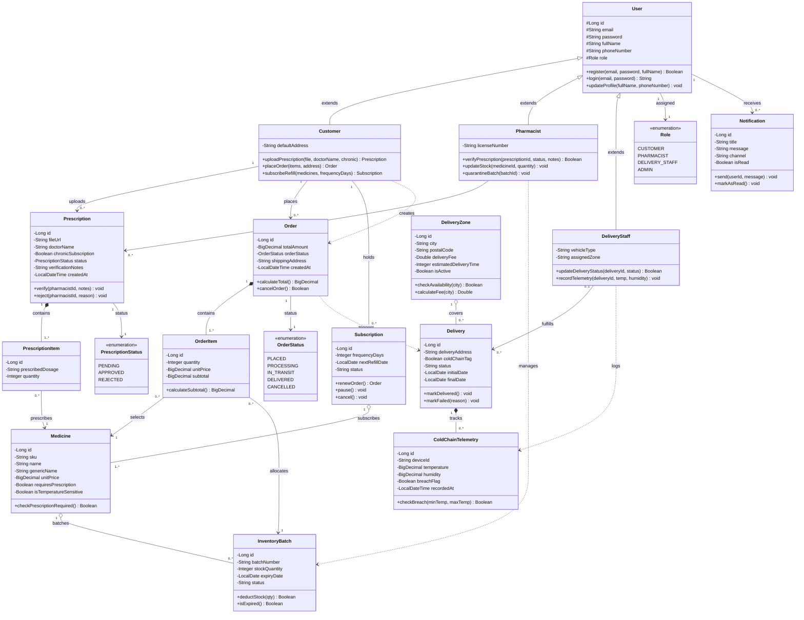

```mermaid
classDiagram
    direction TB

    %% ==========================================
    %% 1. ENUMERATIONS
    %% ==========================================
    class Role {
        <<enumeration>>
        CUSTOMER
        PHARMACIST
        DELIVERY_STAFF
        ADMIN
    }

    class PrescriptionStatus {
        <<enumeration>>
        PENDING
        APPROVED
        REJECTED
    }

    class OrderStatus {
        <<enumeration>>
        PLACED
        PROCESSING
        IN_TRANSIT
        DELIVERED
        CANCELLED
    }

    %% ==========================================
    %% 2. STAKEHOLDERS & USER MANAGEMENT
    %% ==========================================
    class User {
        #Long id
        #String email
        #String password
        #String fullName
        #String phoneNumber
        #Role role
        +register(email, password, fullName) Boolean
        +login(email, password) String
        +updateProfile(fullName, phoneNumber) void
    }

    class Customer {
        -String defaultAddress
        +uploadPrescription(file, doctorName, chronic) Prescription
        +placeOrder(items, address) Order
        +subscribeRefill(medicines, frequencyDays) Subscription
    }

    class Pharmacist {
        -String licenseNumber
        +verifyPrescription(prescriptionId, status, notes) Boolean
        +updateStock(medicineId, quantity) void
        +quarantineBatch(batchId) void
    }

    class DeliveryStaff {
        -String vehicleType
        -String assignedZone
        +updateDeliveryStatus(deliveryId, status) Boolean
        +recordTelemetry(deliveryId, temp, humidity) void
    }

    %% ==========================================
    %% 3. PRESCRIPTION CORE
    %% ==========================================
    class Prescription {
        -Long id
        -String fileUrl
        -String doctorName
        -Boolean chronicSubscription
        -PrescriptionStatus status
        -String verificationNotes
        -LocalDateTime createdAt
        +verify(pharmacistId, notes) void
        +reject(pharmacistId, reason) void
    }

    class PrescriptionItem {
        -Long id
        -String prescribedDosage
        -Integer quantity
    }

    %% ==========================================
    %% 4. MEDICINE & INVENTORY CORE
    %% ==========================================
    class Medicine {
        -Long id
        -String sku
        -String name
        -String genericName
        -BigDecimal unitPrice
        -Boolean requiresPrescription
        -Boolean isTemperatureSensitive
        +checkPrescriptionRequired() Boolean
    }

    class InventoryBatch {
        -Long id
        -String batchNumber
        -Integer stockQuantity
        -LocalDate expiryDate
        -String status
        +deductStock(qty) Boolean
        +isExpired() Boolean
    }

    %% ==========================================
    %% 5. ORDER PROCESSING CORE
    %% ==========================================
    class Order {
        -Long id
        -BigDecimal totalAmount
        -OrderStatus orderStatus
        -String shippingAddress
        -LocalDateTime createdAt
        +calculateTotal() BigDecimal
        +cancelOrder() Boolean
    }

    class OrderItem {
        -Long id
        -Integer quantity
        -BigDecimal unitPrice
        -BigDecimal subtotal
        +calculateSubtotal() BigDecimal
    }

    %% ==========================================
    %% 6. DELIVERY & LOGISTICS CORE
    %% ==========================================
    class Delivery {
        -Long id
        -String deliveryAddress
        -Boolean coldChainTag
        -String status
        -LocalDate initialDate
        -LocalDate finalDate
        +markDelivered() void
        +markFailed(reason) void
    }

    class DeliveryZone {
        -Long id
        -String city
        -String postalCode
        -Double deliveryFee
        -Integer estimatedDeliveryTime
        -Boolean isActive
        +checkAvailability(city) Boolean
        +calculateFee(city) Double
    }

    class ColdChainTelemetry {
        -Long id
        -String deviceId
        -BigDecimal temperature
        -BigDecimal humidity
        -Boolean breachFlag
        -LocalDateTime recordedAt
        +checkBreach(minTemp, maxTemp) Boolean
    }

    %% ==========================================
    %% 7. SUBSCRIPTIONS & NOTIFICATIONS
    %% ==========================================
    class Subscription {
        -Long id
        -Integer frequencyDays
        -LocalDate nextRefillDate
        -String status
        +renewOrder() Order
        +pause() void
        +cancel() void
    }

    class Notification {
        -Long id
        -String title
        -String message
        -String channel
        -Boolean isRead
        +send(userId, message) void
        +markAsRead() void
    }

    %% ==========================================
    %% 8. RELATIONSHIPS & ARROW TYPES
    %% ==========================================
    %% Inheritance / Generalization (<|--)
    User <|-- Customer : extends
    User <|-- Pharmacist : extends
    User <|-- DeliveryStaff : extends

    %% Composition (*--) (Whole owns Parts)
    Order "1" *-- "1..*" OrderItem : contains
    Prescription "1" *-- "1..*" PrescriptionItem : contains
    Delivery "1" *-- "0..*" ColdChainTelemetry : tracks

    %% Aggregation (o--) (Shared / Weak ownership)
    Medicine "1" o-- "0..*" InventoryBatch : batches
    Subscription "1" o-- "1..*" Medicine : subscribes
    DeliveryZone "1" o-- "0..*" Delivery : covers

    %% Association (-->) (Structural directional link)
    User "1" --> "1" Role : assigned
    Customer "1" --> "0..*" Prescription : uploads
    Pharmacist "0..1" --> "0..*" Prescription : verifies
    Customer "1" --> "0..*" Order : places
    DeliveryStaff "0..1" --> "0..*" Delivery : fulfills
    Prescription "1" --> "1" PrescriptionStatus : status
    Order "1" --> "1" OrderStatus : status
    OrderItem "0..*" --> "1" Medicine : selects
    OrderItem "0..*" --> "1" InventoryBatch : allocates
    PrescriptionItem "0..*" --> "1" Medicine : prescribes
    Customer "1" --> "0..*" Subscription : holds
    User "1" --> "0..*" Notification : receives

    %% Dependency (..>) (Transient / Triggers usage)
    Order ..> Delivery : triggers
    Customer ..> Order : creates
    Pharmacist ..> InventoryBatch : manages
    DeliveryStaff ..> ColdChainTelemetry : logs
```
