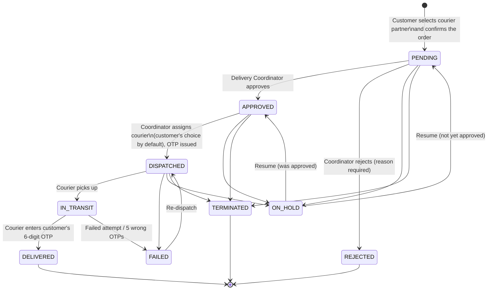
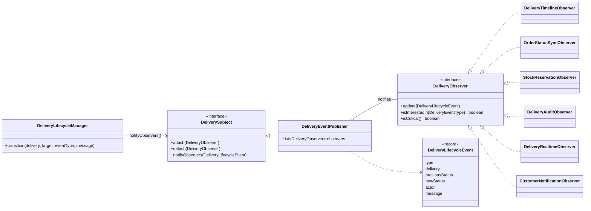

# Delivery Management Module (IT25100979)

Package: `backend/src/main/java/com/mediorder/it25100979_delivery_management`

## 1. Workflow



(POSTPONED behaves like ON_HOLD.) The allowed moves live in one place,
`enums/DeliveryStatus.java`, and every status change goes through
`service/DeliveryLifecycleManager.transition(...)`, so a step can never be skipped.

### Three ways an order reaches Delivery Management

| Source | Who | What happens |
|---|---|---|
| Cart checkout | Customer | Picks a delivery partner and address → Order + PENDING delivery. Stock is **reserved** (FEFO) and deducted on delivery. |
| Prescription | Customer uploads (with address/phone/partner) → pharmacist approves → pharmacist **Dispense** | Pharmacist picks the medicines from the catalog. Stock is **deducted immediately**, then Order + PENDING delivery are created. |
| Refill subscription | Pharmacist **Refill now** (pharmacist dashboard → Refills) | Same as prescription dispensing, then the next refill date moves forward. |

All three end up in the same approval queue, and the same state machine applies. Delivery fees always come
from the active delivery zone covering the address; uncovered addresses are refused. If a delivery is
rejected or terminated, reserved stock is released and deducted stock goes back on the shelf. A prescription
can be used for one order only (unless that order was rejected or terminated).

## 2. Design pattern: Observer

When a delivery changes, several unrelated things must happen: record the timeline,
keep the linked order in sync, write the audit log, push a live update to the
Delivery Management page, and notify the customer. Instead of the service calling
each of these directly, the service only **notifies a subject**, and each reaction is
an independent **observer**.



| Role in pattern | Class | What it does |
|---|---|---|
| Subject (interface) | `observer/DeliverySubject` | attach / detach / notify |
| Concrete subject | `observer/DeliveryEventPublisher` | Holds observers. Spring auto-attaches every `DeliveryObserver` bean |
| Observer (interface) | `observer/DeliveryObserver` | `update(event)` + optional type filter |
| Event (state passed) | `event/DeliveryLifecycleEvent`, `event/DeliveryEventType` | What happened, before/after status, who did it |
| Concrete observer | `observer/impl/DeliveryTimelineObserver` | Saves a row in `delivery_events` (critical: runs in the same transaction) |
| Concrete observer | `observer/impl/OrderStatusSyncObserver` | Updates the linked order in the Order module (critical) |
| Concrete observer | `observer/impl/StockReservationObserver` | Delivered → deducts the stock reserved at checkout; rejected/terminated → returns it (critical) |
| Concrete observer | `observer/impl/DeliveryAuditObserver` | Writes to the system audit log (after commit) |
| Concrete observer | `observer/impl/DeliveryRealtimeObserver` | Pushes Server-Sent Events to the Delivery page and the customer's tracking page (after commit) |
| Concrete observer | `observer/impl/CustomerNotificationObserver` | In-app notifications to coordinators (new request) and customers (progress), after commit |

Why this pattern helps here:
- **Open/Closed:** adding e.g. an SMS observer is a new class; no workflow code changes.
- **Loose coupling:** `DeliveryService` doesn't know about SSE, notifications or audit.
- **Consistency:** "critical" observers run inside the transaction, so a delivery and its order/timeline can never disagree. Best-effort observers run after commit, so nobody is told about a change that was rolled back.

Tests: `observer/DeliveryEventPublisherTest`, `observer/OrderStatusSyncObserverTest`;
`service/DeliveryServiceTest` uses a `RecordingObserver` to assert which events fire.

## 3. Folder structure

```
config/        DeliveryConfig, DeliverySecurityRules (URL rules plugged into core auth), zone seed data
controller/    DeliveryController (coordinator), CustomerDeliveryController, CourierController, DeliveryZoneController
dto/request/   validated request bodies (CustomerDeliveryRequest, AssignDeliveryRequest, ...)
dto/response/  DeliveryResponse (staff, no OTP), CourierDeliveryResponse, CustomerDeliveryResponse (with OTP)
entity/        Delivery, DeliveryTimelineEntry, DeliveryZone
enums/         DeliveryStatus (state machine), CourierCompany, DeliveryActionType
event/         DeliveryLifecycleEvent, DeliveryEventType
exception/     DeliveryNotFoundException (404), InvalidDeliveryStateException (409), InvalidOtpException (400), DeliveryExceptionHandler
mapper/        DeliveryMapper (entity -> DTO per audience)
observer/      DeliverySubject, DeliveryObserver, DeliveryEventPublisher, AfterCommit
observer/impl/ the six concrete observers
repository/    DeliveryRepository, DeliveryTimelineRepository, DeliveryZoneRepository
service/       DeliveryService, CustomerDeliveryService, DeliveryLifecycleManager, DeliveryOtpService, DeliveryZoneService
validation/    @ValidCourier + CourierCompanyValidator, shared regex patterns
```

## 4. REST API

| Who | Method & path | Purpose |
|---|---|---|
| Public | `GET /api/v1/customer/deliveries/courier-partners` | Partners shown at checkout |
| Customer | `POST /api/v1/customer/deliveries` | Confirm order with chosen partner → Order + PENDING delivery |
| Customer | `GET /api/v1/customer/deliveries[/{id}]` | Track own deliveries (OTP shown only while with the courier) |
| Pharmacist | `POST /api/v1/pharmacy/prescriptions/{id}/dispense` | Pick medicines for an approved prescription → order + delivery |
| Pharmacist | `POST /api/v1/pharmacy/subscriptions/{id}/refill` | Send the next refill → order + delivery |
| Pharmacist | `GET /api/v1/pharmacy/prescriptions/dispensed` | Which prescriptions already have an order |
| Coordinator | `GET /api/v1/deliveries?status=` | Delivery Management list |
| Coordinator | `PUT /api/v1/deliveries/{id}/approve` · `/reject` | Approval step |
| Coordinator | `PUT /api/v1/deliveries/assign` | Assign courier (defaults to customer's choice), issues OTP |
| Coordinator | `PUT /api/v1/deliveries/{id}/action` | HOLD / POSTPONE / TERMINATE / RESUME |
| Coordinator | `POST /api/v1/deliveries/{id}/regenerate-otp` · `GET /{id}/timeline` | |
| Courier | `GET /api/v1/courier/deliveries` · `PUT /{id}/status` | IN_TRANSIT / FAILED / DELIVERED (+OTP) |
| Public read / Coordinator write | `/api/v1/delivery-zones` | Routes & fees |
| Anyone | `GET /api/v1/realtime/stream/deliveries` | SSE live feed (no personal data in payload) |

Roles: Coordinator = `DELIVERY_COORDINATOR`, `ADMIN`, `SYSTEM_ADMIN`; Courier adds `DELIVERY_RIDER`.

## 5. Running locally

```bash
./scripts/local-db.sh start           # private MySQL on port 3307 (data in .local-mysql/)
cd backend && ./mvnw spring-boot:run  # no config file needed (see below)
cd frontend && npm install && npm run dev
./scripts/e2e-delivery-flow.sh        # end-to-end check of the workflow + security
```

The backend ships with built-in defaults (`backend/src/main/resources/mediorder-defaults.properties`)
that point at the local MySQL above. To use a different database either export
`DB_HOST`, `DB_PORT`, `DB_NAME`, `DB_USER`, `DB_PASSWORD`, or create your own gitignored
`backend/src/main/resources/application.yml` from `application.yml.example`; both override the defaults.

Demo accounts (password `admin123`): `customer1@gmail.com`, `deliverycoordinator1@gmail.com`.
