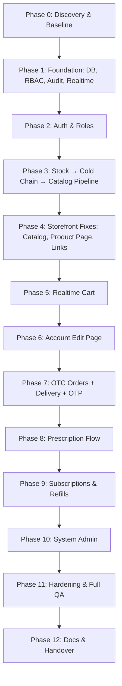
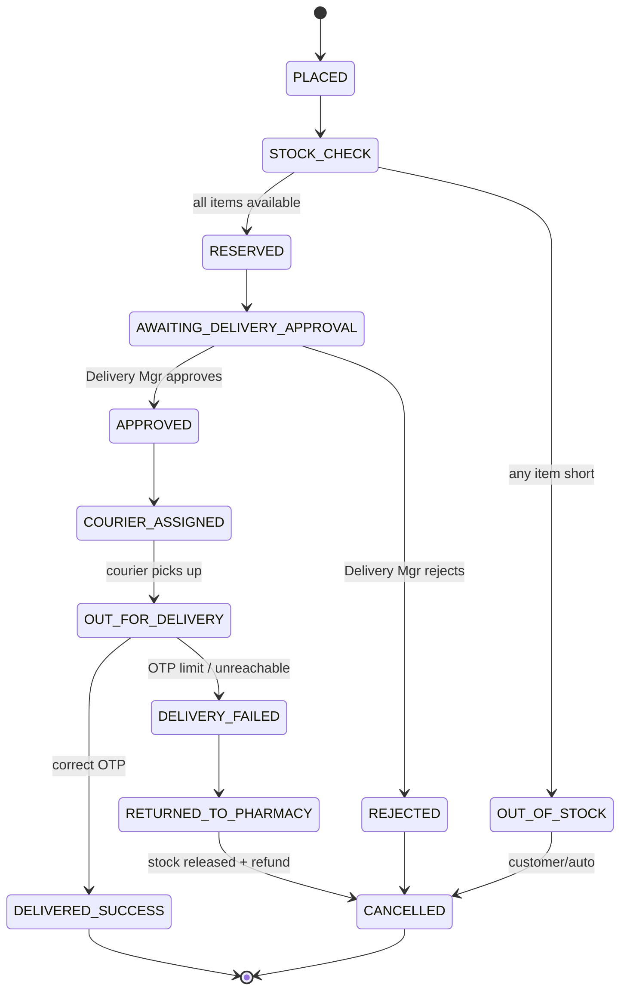
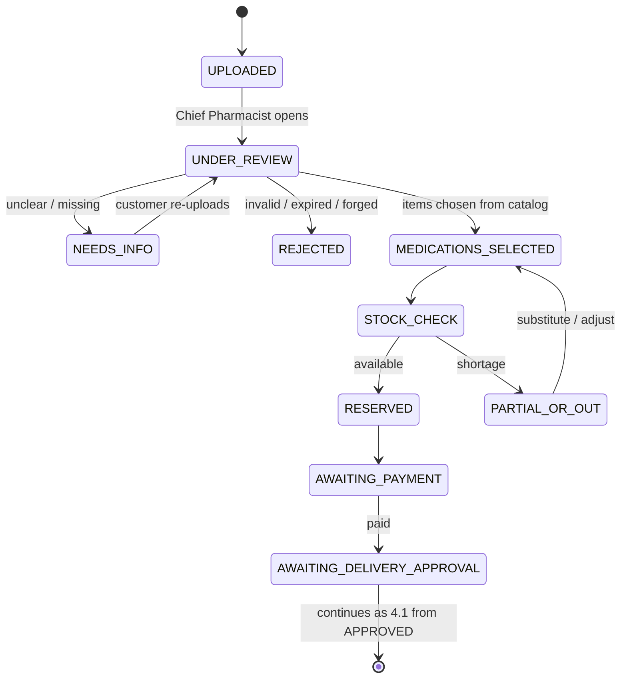
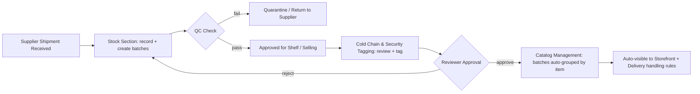
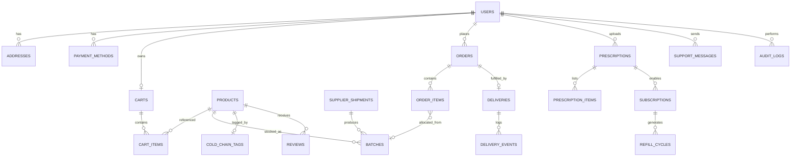

---

## 1. Mission and Operating Rules

### 1.1 Mission

Finish the existing pharmacy web app so that **customers**, **pharmacy staff roles**, **couriers**, and a **System Admin** can complete every workflow end to end, with **no console errors, no broken routes, no dead buttons, and no data inconsistencies**.

### 1.2 Non-Negotiable Rules for the Agent

1. **Read the existing code before writing anything.** Reuse the current stack, folder structure, naming, and components. Do not rewrite or migrate frameworks.
2. **Never invent values the code already defines** (e.g. the 5 cold-chain sections, enums, role names). Search the repo first; use this document's fallbacks only if nothing exists.
3. **Database is the single source of truth.** UI never holds authoritative state (cart, stock, order status).
4. **Every state change goes through a server-side state machine** (Section 4). Illegal transitions must be rejected with a clear error.
5. **Every mutation writes an audit log entry** (who, role, action, entity, before/after, timestamp, IP).
6. **Every list/detail page needs four states:** loading, empty, error, success.
7. **Use database transactions and row locks** wherever stock, orders, or payments change.
8. **Never expose secrets, raw card numbers, OTPs, or password hashes** to the client or logs.
9. **One task at a time, small commits**, each with a message like `feat(cart): realtime sync`.
10. **Do not skip a Gate.** If something fails, fix it, re-test, then continue.
11. If anything is ambiguous, **pick the safest documented default (Section 16), note it in the plan, and continue** — do not stop to ask unless blocked.

---

## 2. Build Order (Master Roadmap)



**Why this order:** the catalog must contain *approved, tagged, in-stock* items (Phase 3) before the storefront, cart, and orders can be meaningfully built and tested.

---

## 3. Roles and Permission Matrix

### 3.1 Roles

| Role | Type | Purpose |
|---|---|---|
| **Customer** | Public user | Browse, cart, order, upload prescriptions, manage account |
| **Chief Pharmacist** | Staff admin | Prescription review, medication selection, refills, cold chain & security tagging |
| **Operations Manager** | Staff admin | Stock intake, batches, catalog management |
| **Delivery Manager** | Staff admin | Approve deliveries, assign couriers, monitor deliveries |
| **Courier** | Staff (limited) | Pick up, deliver, verify OTP |
| **Finance Manager** | Staff admin | Payments, refunds, invoices, reports |
| **IT Manager** | Staff admin | System health, errors, user/session tools |
| **System Admin** | Super admin | Everything above + moderation, kill switches, audit, DB refresh |

> If the codebase already uses different role names, **map to the existing names** and keep this table's responsibilities.

### 3.2 Permission Matrix (✔ = full, 👁 = read-only, ✖ = none)

| Module | Customer | Chief Pharm. | Ops Mgr | Delivery Mgr | Courier | Finance | IT | System Admin |
|---|---|---|---|---|---|---|---|---|
| Storefront / Cart / Orders (own) | ✔ | ✖ | ✖ | ✖ | ✖ | ✖ | ✖ | 👁 |
| Prescription Management | ✖ | ✔ | 👁 | ✖ | ✖ | ✖ | ✖ | ✔ |
| Cold Chain & Security Tagging | ✖ | ✔ | ✔ (review) | 👁 | ✖ | ✖ | ✖ | ✔ |
| Subscriptions & Refills | own request | ✔ | ✖ | 👁 | ✖ | 👁 | ✖ | ✔ |
| Stock Section | ✖ | 👁 | ✔ | ✖ | ✖ | 👁 | ✖ | ✔ |
| Catalog Management (batches) | ✖ | 👁 | ✔ | 👁 | ✖ | ✖ | ✖ | ✔ |
| Delivery Management | own tracking | ✖ | ✖ | ✔ | assigned only | ✖ | ✖ | ✔ |
| Finance Management | own invoices | ✖ | ✖ | ✖ | ✖ | ✔ | ✖ | ✔ |
| IT Management / Error Logs | ✖ | ✖ | ✖ | ✖ | ✖ | ✖ | ✔ | ✔ |
| Audit Logs | ✖ | own actions | own actions | own actions | ✖ | own actions | 👁 all | ✔ all |
| Review Moderation / Messages / Kill Switches / DB Refresh | ✖ | ✖ | ✖ | ✖ | ✖ | ✖ | ✖ | ✔ |

**Enforcement:** permissions are checked **on the server for every endpoint** (middleware/policy), then mirrored in the UI by hiding links. Hiding a button is never security.

---

## 4. Core State Machines (Server-Enforced)

### 4.1 OTC Order → Delivery



### 4.2 Prescription Order



### 4.3 Stock → Shelf → Catalog Pipeline



### 4.4 Delivery Record (derived from the order but has its own status)

`PENDING_APPROVAL → APPROVED → COURIER_ASSIGNED → PICKED_UP → OUT_FOR_DELIVERY → SUCCESSFUL | FAILED → RETURNED`

**Rule:** the Order status and Delivery status must always be updated **in the same DB transaction**.

---

## 5. Phase 0 — Discovery and Baseline

1. Scan the repo and write a **Discovery Report artifact** containing:
   - Stack (frontend, backend, DB, ORM, auth, realtime tech, file storage)
   - Existing routes, pages, components, API endpoints
   - Existing DB tables and enums (especially **roles**, **order statuses**, **the 5 cold-chain sections**)
   - Existing seed data and env variables
2. Run the app. Record every **console error, failing API call, and broken link** in a **Bug Baseline list**.
3. Open the Stitch project through the Stitch MCP (or the exported design files in the repo). List every screen and design token (colors, fonts, spacing, radius, shadows).
   - If Stitch is not reachable, **stop and report it as a blocker** for the Product Page only; continue with other tasks.
4. Create `.env.example` listing all required variables.
5. Create a git branch: `feature/pharmacy-completion`.

> 🚦 **Gate 0:** Discovery Report + Bug Baseline + Implementation Plan approved.

---

## 6. Phase 1 — Foundation (Database, RBAC, Audit, Realtime)

### 6.1 Database Changes (add only what is missing — use migrations, never manual edits)



| Table | Key columns (add/verify) |
|---|---|
| `users` | id, role, email (unique), password_hash, status (`ACTIVE`/`PENDING_APPROVAL`/`SUSPENDED`), avatar_url, phone, is_demo |
| `addresses` | user_id, label, line1, line2, city, region, postal_code, country, lat/lng (optional), is_default_shipping |
| `payment_methods` | user_id, provider_token, brand, last4, exp_month, exp_year, billing_address_id, is_default — **no raw PAN/CVV ever** |
| `carts` / `cart_items` | cart_id, product_id, qty, unit_price_snapshot, **UNIQUE(cart_id, product_id)** |
| `suppliers`, `supplier_shipments` | supplier, reference_no, received_at, received_by, status |
| `batches` | product_id, shipment_id, batch_no, qty_received, qty_available, qty_reserved, **arrived_date, expiry_date**, status (`QC_PENDING`/`APPROVED_FOR_SHELF`/`COLD_CHAIN_REVIEW`/`LIVE`/`QUARANTINED`/`EXPIRED`) |
| `cold_chain_tags` | product_id, section (one of the 5), storage_temp_min/max, shelf_life_days, intensity, delivery_actions (JSON), security_level, status (`DRAFT`/`PENDING_REVIEW`/`APPROVED`), reviewed_by |
| `orders`, `order_items` | user_id, type (`OTC`/`PRESCRIPTION`/`REFILL`), status, totals, address_snapshot, payment_status, prescription_id |
| `stock_reservations` | order_id, batch_id, qty, expires_at, status |
| `deliveries`, `delivery_events` | order_id, status, courier_id, otp_hash, otp_expires_at, otp_attempts, delivered_at, handling_instructions (snapshot of tag actions) |
| `prescriptions`, `prescription_items` | user_id, file_url, status, reviewed_by, valid_until, refills_allowed, refills_used, notes |
| `subscriptions`, `refill_cycles` | see Phase 9 |
| `reviews` | product_id, user_id, rating, text, status (`VISIBLE`/`HIDDEN`/`REMOVED`), moderated_by |
| `support_messages`, `support_replies` | user_id, subject, body, status (`OPEN`/`REPLIED`/`CLOSED`) |
| `audit_logs` | actor_id, actor_role, action, entity, entity_id, before, after, ip, created_at — **append-only** |
| `error_logs` | source (`frontend`/`backend`), message, stack, route, user_id, severity, resolved |
| `feature_flags` | key, enabled, scope (`GLOBAL`/`PRODUCT`), target_id, reason, set_by, set_at, resume_at |
| `notifications` | user_id, type, payload, read_at |

### 6.2 Backend Foundation Tasks

1. **RBAC middleware/policies** using the matrix in Section 3.
2. **Audit service** (`audit.log(...)`) called inside every service-layer mutation.
3. **Central error handler** → writes to `error_logs` and returns a safe JSON `{ code, message, requestId }`.
4. **Realtime channel layer** (reuse the project's tech: WebSocket / SSE / Supabase-Firebase realtime). Channels: `cart:{userId}`, `order:{orderId}`, `delivery:{id}`, `inventory`, `admin:alerts`.
5. **Validation layer** (Zod/Joi/pydantic equivalent) on all request bodies.
6. **Feature-flag guard** that blocks endpoints when a flag is off (used by System Admin kill switches).
7. **Background job runner** (cron/queue) for: reservation expiry, batch expiry sweep, refill scheduler, OTP expiry.
8. **Seed script** with demo users for every role, sample suppliers, products, batches, tags.

> 🚦 **Gate 1:** migrations run clean on an empty DB; seed works; RBAC unit tests pass; audit log entry appears for a test mutation.

---

## 7. Phase 2 — Authentication and Roles

### 7.1 Separate Account Creation (Customer vs Admin)

1. **Customer sign-up:** route `/signup` → creates `Customer`, status `ACTIVE` (email verification if the project supports it).
2. **Admin/Staff sign-up:** separate route `/admin/signup` with its own page and layout.
   - Fields: name, work email, phone, **requested role** (Chief Pharmacist, Operations, Delivery, Courier, Finance, IT), and an **invite code** *(optional if System Admin approval is enabled)*.
   - Result: account status = `PENDING_APPROVAL`. **Cannot log in until System Admin approves.**
   - **System Admin cannot be self-registered.** Create only through seed script or a CLI command.
3. Separate login entry points: `/login` (customers) and `/admin/login` (staff). The server also verifies the role matches the entry point.
4. Password rules: min 8 chars, hashed (argon2/bcrypt), rate-limited login (e.g. 5 tries / 15 min), generic error messages, secure httpOnly cookies or short-lived JWT + refresh.
5. Add **forgot/reset password** flow (token, expiry, single use).

### 7.2 One-Click Demo Login (No Login / No Account Needed)

1. On both login pages add a **"Quick Demo Access"** panel with buttons:
   `Continue as Customer` · `Chief Pharmacist` · `Operations Manager` · `Delivery Manager` · `Courier` · `Finance` · `IT` · `System Admin`
2. Each button calls `POST /api/auth/demo` with `{ role }` → server signs in the **seeded demo user** for that role (`is_demo = true`) and redirects to that role's dashboard.
3. **Security controls (mandatory):**
   - Controlled by env `ENABLE_DEMO_LOGIN=true`. In production default is `false`: endpoint returns 404 and buttons are not rendered.
   - Rate-limit the endpoint; demo sessions expire in 2 hours.
   - Demo users cannot change credentials, delete data permanently, or trigger real emails/payments.
   - Show a visible **"Demo Mode"** banner.
4. Provide a **"Reset Demo Data"** script (non-production only).

> 🚦 **Gate 2:** each role logs in via its own page; demo buttons land on correct dashboards; pending staff cannot log in; role escalation attempt (editing request body to `SYSTEM_ADMIN`) is rejected and audit-logged.

---

## 8. Phase 3 — Stock → Cold Chain & Security Tagging → Catalog Pipeline

### 8.1 Stock Section (Operations Manager)

1. Page: **Stock → Incoming Shipments**. Form: supplier, reference no., received date, line items (product, batch no., quantity, **arrived date**, **expiry date**).
2. Saving creates `supplier_shipments` + `batches` with status `QC_PENDING`.
3. **QC action:** pass → `APPROVED_FOR_SHELF`; fail → `QUARANTINED` (with reason).
4. Validation: expiry date must be after arrived date; reject already-expired or <30-day shelf life (configurable warning); batch_no unique per product.
5. When approved for shelf, the batch automatically appears in **Cold Chain & Security Tagging** with status `COLD_CHAIN_REVIEW`.

### 8.2 Create #1 — Cold Chain & Security Tagging Module (inside Prescription Management)

Build one **shared module**, mounted as a tab/section **inside Prescription Management → "Catalog & Cold Chain Tagging"**, and also reachable from the stock pipeline (same component, same API, no duplicated logic).

**Features**

1. List all catalog items and batches awaiting tagging/review, with filters (status, section, product, expiry).
2. **Tag editor** per item:
   - **Shelf section** — assign to one of the **5 main sections defined in the code** *(read them from existing constants/enums; fallback only if none exist: Ambient, Cool Room 15–25°C, Refrigerated 2–8°C, Frozen, Controlled/Secured Vault)*
   - **Storage temperature range**
   - **Shelf life** (days; used to auto-calculate/validate expiry)
   - **Intensity** (medicine potency/risk class, e.g. Low / Medium / High / Critical)
   - **Security level** (Standard / Tamper-evident / Locked / Controlled-substance)
   - **Delivery handling actions** (checkboxes + free text): insulated box, ice pack, keep upright, avoid sunlight, signature required, ID/age check, max transit hours, no-leave-at-door
3. **Shelf arrangement view:** items displayed grouped by section (drag-and-drop or "Move to section" action). Every move is audit-logged.
4. **Review & approve:** Chief Pharmacist (or reviewer) approves → batch status `LIVE` → item syncs to Catalog Management.
5. Items with *Critical/Controlled* settings force **dual-confirmation** (second reviewer or confirm dialog with reason).

### 8.3 Create #2 — Catalog Management (inside Operations Management page)

1. Catalog list: **one row per item type** (product), expandable to show its **batches**.
2. For each batch show: batch no., **arrived date**, **expiry date**, qty available / reserved, section, days-to-expiry badge (green/amber/red), status.
3. Batches of the same product are auto-grouped; totals roll up to the product (`available = Σ batch.qty_available − Σ reserved`).
4. **FEFO allocation (First-Expire-First-Out):** orders always allocate from the earliest non-expired `LIVE` batch.
5. Nightly job: mark expired batches `EXPIRED`, remove from sale, notify Operations + System Admin; warn at 30/60 days.
6. **Auto-propagation:** when a batch goes `LIVE`, or its tag changes, the storefront availability, product page info (storage notes, Rx-required flag), and **delivery handling instructions** update automatically (via DB + realtime event `inventory`). Orders **snapshot** the handling instructions at creation so later edits don't change in-flight deliveries.

> 🚦 **Gate 3:** receive a shipment with 2 batches of the same drug → QC pass → tag → approve → it shows on Catalog Management grouped under one item → appears on storefront; expired batch is never sold; a rejected tag blocks storefront visibility.

---

## 9. Phase 4 — Storefront UI Fixes

### 9.1 Product Catalog Page — Reset Filters

1. On first load, **all products are visible with zero filters applied**.
2. Filters live in URL query params (`?category=&price=&sort=`) — an empty URL means no filters. Never restore filters from stale `localStorage` or global state on mount.
3. Reset filter state in the page's mount/cleanup logic; add a visible **"Clear all filters"** button and active-filter chips.
4. Pagination or infinite scroll (e.g. 12–24 per page) so "all products" stays fast; include skeleton loaders and "no results" state.
5. Hide items that are not `LIVE`/in-stock-eligible; show "Out of stock" for live-but-zero-qty items.

### 9.2 Product Detail Page (from Stitch design)

1. Fetch the product page screen from **Stitch** and rebuild it as a **React component** using the project's component library and the Stitch design tokens (fonts, colors, spacing). Match layout, states, and responsive behavior.
2. Route: **`/products/:id`** (or slug). Server-side data: name, images, price, description, dosage info, active ingredients, **Rx required badge**, availability (live stock), storage notes (from cold-chain tag), expiry (nearest batch), reviews + rating, related products.
3. Actions: quantity selector (capped at available stock), **Add to Cart** (uses realtime cart, Phase 5), **Upload Prescription** CTA for Rx items.
4. Handle: invalid id → friendly 404 page; loading skeleton; out-of-stock disabled button with "Notify me" (optional); image fallback.
5. Reviews: only verified purchasers can post; one review per product per user; moderated by System Admin.
6. SEO: page title/meta per product.

### 9.3 Navigation Wiring

1. Clicking any product card — **Landing page → Featured Products, Browse section, Catalog grid, Search results, Related products, Cart items, Order history** — navigates to `/products/:id` of **that exact product**.
2. Use the product's unique ID in every card link (no shared/hard-coded IDs). Cards must be keyboard accessible (`<a>`/`<Link>`).
3. Add automated check: crawl all product links on landing + catalog and assert each resolves to the matching product page.

> 🚦 **Gate 4:** fresh browser load of `/catalog` shows full product list with no filters; clicking 10 random products from 4 different entry points opens the correct product page each time; Stitch visual comparison passes.

---

## 10. Phase 5 — Real-Time Cart

1. **Server-side cart** per user in `carts` / `cart_items`. Endpoints: `GET /cart`, `POST /cart/items`, `PATCH /cart/items/:id`, `DELETE /cart/items/:id`, `POST /cart/merge`.
2. **Add to cart → DB write → realtime broadcast** `cart:{userId}` → navbar badge, cart drawer, and cart page update instantly (also across open tabs/devices).
3. **Optimistic UI** with rollback and toast on failure.
4. Server validations on every change: product `LIVE`, not disabled by a kill switch, qty ≥ 1, qty ≤ available stock, max per-order limit; **price always re-read from DB** (never trusted from client).
5. **Guest cart:** keep in a cookie/localStorage, **merge into the DB cart on login/sign-up** (sum quantities, cap by stock).
6. **Rx-required items:** may be added to cart, but checkout forces the **Prescription flow** (Phase 8); OTC and Rx items in one cart are split into separate orders.
7. **Stale cart handling:** if an item becomes unavailable or its price changes, show a banner and auto-adjust at checkout.
8. **Idempotency keys** on checkout to prevent double orders on double-click/network retry.
9. Checkout: choose saved address and payment method (from Account page), review totals (subtotal, delivery fee, tax), place order.

> 🚦 **Gate 5:** add/remove/update in one tab reflects in another within ~1 second; DB rows match UI; adding more than stock is blocked; guest → login merge works; no duplicate rows for the same product.

---

## 11. Phase 6 — Create #4: Account Edit Page

Route: `/account` (tabs). Available to Customers (and basic profile for staff).

| Tab | Features |
|---|---|
| **Profile** | Name, phone, email (re-verify on change), **profile picture upload** (jpg/png/webp, ≤2 MB, server-side type check, resize/crop, old file deleted) |
| **Security** | Change password (requires current password), active sessions list + "log out other devices", optional 2FA |
| **Billing** | Add/edit/remove payment methods via **tokenization** (provider token + brand + last4 + expiry only). Billing address. Set default. |
| **Shipping Addresses** | Multiple addresses, label, default selection, validation (postal code, phone), optional map pin |
| **Orders & Prescriptions** | History + tracking links (read-only here) |

**Auto-sync to other modules (mandatory):**

1. Default **shipping address + phone** are referenced by Delivery Management (by `address_id`), and each order stores an **address snapshot** at purchase time.
2. Default **payment method** (token reference) feeds checkout and Finance Management.
3. Editing an address **after** an order is placed does not alter that order unless the customer uses "Change delivery address" while status ≤ `AWAITING_DELIVERY_APPROVAL`.
4. Realtime event pushes changes to Delivery Management views for open/pending orders.
5. Never store raw card numbers/CVV. If no payment gateway exists, build a **mock gateway adapter** with the same interface so a real one can be swapped in later.
6. Account deletion/export request (soft-delete + anonymize PII, keep order/audit records).

> 🚦 **Gate 6:** update address + avatar + payment → reflected at checkout and in the Delivery Management record of a new order; invalid file upload rejected.

---

## 12. Phase 7 — OTC Order, Delivery Management, Courier OTP

### 12.1 Flow

```
Customer places OTC order
        ↓
Inventory check (transaction + row lock, FEFO allocation)
        ↓
  Available? ── No → Order OUT_OF_STOCK → notify customer (cancel/backorder), release holds
        ↓ Yes
Stock RESERVED → order appears in Delivery Management → "Pending Approval"
        ↓
Delivery Manager reviews → Approve  (or Reject with reason → refund + release stock)
        ↓
Order goes to Courier queue → Delivery Manager assigns a courier
        ↓
Courier picks up → OUT_FOR_DELIVERY (sees handling instructions from cold-chain tags)
        ↓
Customer receives OTP (order tracking page / SMS-email) → tells courier
        ↓
Courier enters OTP inside Delivery Management
        ↓
Correct OTP → status SUCCESSFUL → stock deducted permanently, payment captured/settled
```

### 12.2 Implementation Details

1. **Inventory check** executes inside one DB transaction: lock candidate batches → verify qty → create `stock_reservations` → decrement `qty_available`, increment `qty_reserved`. Two customers buying the last unit → exactly one succeeds.
2. **Reservation expiry:** unpaid/unapproved reservations auto-release after a configurable window (e.g. 30 min for unpaid, none once approved).
3. **Delivery Management page (Delivery Manager):** tabs *Pending Approval · Approved · With Courier · Out for Delivery · Successful · Failed/Returned*; filters, search, order details with handling instructions and address snapshot, approve/reject (reason required), assign courier.
4. **Courier view:** only assigned deliveries; buttons *Picked Up*, *Out for Delivery*, *Enter OTP*, *Report Failed Attempt* (reason + photo optional).
5. **OTP rules:**
   - 6 digits, generated when status becomes `OUT_FOR_DELIVERY`, stored **hashed**, expires (e.g. 24 h), single use.
   - Max **5 wrong attempts** → delivery flagged `FAILED_VERIFICATION`, Delivery Manager alerted; manager can regenerate OTP (audit-logged).
   - OTP shown only to the customer (tracking page / notification), **never** returned in courier or admin API responses.
6. **On `SUCCESSFUL`:** reservation committed, order `DELIVERED_SUCCESS`, delivery event logged, customer notified, review prompt enabled.
7. **On failure/return:** stock released back to the same batch, refund triggered via Finance, audit entry.
8. **Special handling:** if a tag requires *signature/ID check/cold pack*, the courier UI shows a mandatory confirmation checklist before OTP entry.
9. Customer **order tracking page** with live timeline (realtime).

> 🚦 **Gate 7:** full OTC journey passes in the browser; wrong OTP ×5 locks; out-of-stock path works; concurrent last-unit test passes; status never skips a step.

---

## 13. Phase 8 — Prescription Flow

### 13.1 Customer Side

1. Upload prescription (PDF/JPG/PNG, ≤10 MB, virus/type check, stored privately — **access only via signed URLs**, never public).
2. Optional fields: doctor name, license no., issue date, notes.
3. Status tracker (`UPLOADED → UNDER_REVIEW → …`) with realtime updates and messages from the pharmacist (e.g. NEEDS_INFO).

### 13.2 Chief Pharmacist Side — Prescription Management

1. Queue sorted by oldest/urgent; open a prescription viewer (zoom/rotate).
2. **Validate:** issue date, validity period, doctor details, patient name match, duplicates (hash of file), controlled-substance rules.
3. **Select medications** from the catalog (search) with dosage/quantity/duration; the system checks:
   - Interaction/allergy warning (basic rule table or manual notes field; clearly marked as pharmacist-reviewed)
   - Max quantity limits
   - **Inventory check** (same transaction logic as Phase 7)
4. Outcomes: *Approve & Send to Delivery*, *Request more info*, *Reject (reason required)*, *Substitute* (generic alternative — customer notified/consent).
5. After approval and payment, the order flows into **Delivery Management** exactly like Phase 7 (same state machine, same OTP).
6. Every decision is audit-logged with the pharmacist's id.

> 🚦 **Gate 8:** upload → review → select meds → stock reserved → payment → delivery → OTP success; rejected/expired prescriptions can't proceed; private file URLs are not guessable.

---

## 14. Phase 9 — Create #3: Subscriptions and Refills (inside Prescription Management)

### 14.1 Data Model

- `subscriptions`: id, user_id, prescription_id, product_id, mode (`MANUAL` | `AUTO`), interval_days, qty_per_cycle, status (`PENDING` | `ACTIVE` | `PAUSED` | `TERMINATED` | `COMPLETED`), auto_refill_until (date), cycles_allowed, cycles_used, next_refill_at, terminated_reason
- `refill_cycles`: id, subscription_id, due_at, status (`DUE` | `AWAITING_PHARMACIST` | `APPROVED` | `ORDERED` | `SKIPPED` | `FAILED`), approved_by, order_id

### 14.2 Features

1. **Customer** requests a refill/subscription for an approved prescription item.
2. **Manual mode (default):** for **every cycle**, the Chief Pharmacist must **re-check the prescription** and manually approve → only then is an order created and sent to Delivery Management.
3. **Auto-refill mode:** the pharmacist can enable it **per medication type** (eligibility rules table, e.g. chronic/maintenance meds allowed; antibiotics, controlled substances, high-intensity drugs **never** auto) and sets a **timer in days** (`auto_refill_until`). The scheduler automatically creates refill orders each interval until the timer ends; then it **stops automatically** and notifies customer + pharmacist for manual renewal.
4. **Terminate refills** at any time (pharmacist or System Admin; customer can request termination): cancels future cycles, releases any reserved stock, logs reason.
5. Pause/resume, change interval/quantity (pharmacist only), view history of cycles.
6. **Scheduler checks each cycle:** prescription still valid, `refills_used < refills_allowed`, stock available (else status `FAILED` + notify, retry next day up to N times), payment method valid (else notify customer), kill switches not active.
7. Notifications: 3 days before due, on approval needed, on ordered, on failure, on auto-refill end.
8. UI: *Subscriptions* tab with filters (Needs approval, Active auto, Ending soon, Terminated); bulk-approve is **not allowed** — each cycle requires individual review.

> 🚦 **Gate 9:** manual cycle needs approval each time; auto mode creates orders on schedule and stops exactly at the timer end (test with a short interval via time-mocking); terminated subscriptions never generate orders; controlled meds cannot be set to auto.

---

## 15. Phase 10 — Create #5: System Admin Role and Page

Route: `/admin/system` (guarded by `SYSTEM_ADMIN` only). Layout: left nav + dashboard cards (open errors, pending approvals, unread messages, low stock, expiring batches, active kill switches).

| # | Module | Capabilities |
|---|---|---|
| 1 | **Staff & Access** | Approve/reject/suspend staff sign-ups, change roles, force logout, reset staff passwords |
| 2 | **Review Moderation** | List all reviews, filter reported/low-rated; hide/remove unsuitable reviews with reason; restore |
| 3 | **Customer Messages** | Inbox with threads, status, search; reply (notification to customer); close/reopen; canned replies |
| 4 | **Error & System Problems** | View `error_logs` (frontend + backend), group by message, severity, mark resolved, assign to IT |
| 5 | **Audit Logs** | Unified view of audit entries from **all** management modules; filter by actor, role, module, date, entity; export CSV; append-only (no edit/delete) |
| 6 | **Kill Switches (Workflow Control)** | Toggle: Stock intake, Delivery, Ordering, Prescriptions, Refills, and **individual medicines**. Requires reason; optional auto-resume time. Effects: server rejects related actions with a clear message; storefront shows "temporarily unavailable"; staff dashboards show a banner. All toggles audit-logged. |
| 7 | **Database Refresh / Maintenance** | (a) **Refresh & Re-sync:** clear caches, rebuild derived availability/search data, re-run integrity checks, expire stale reservations. (b) **Reset to seed:** *non-production only*, auto-backup first, typed confirmation. In production, destructive reset is disabled. |
| 8 | **IT Management** | System health (uptime, DB status, job queue, storage), user/session tools, feature-flag view, deployment info |
| 9 | **Finance Management** | Payments list, refunds, invoices, daily/monthly revenue, reconciliation, export |
| 10 | **Oversight** | Read/write across Prescription, Stock, Catalog, Cold Chain, Delivery, Subscriptions (with audit) |

**Safeguards:** re-enter password for dangerous actions (DB refresh, role change, kill switch for entire workflow), two-person rule optional via setting, and an "Are you sure?" dialog describing the impact.

> 🚦 **Gate 10:** each of the 10 modules works; a kill switch really blocks the matching API calls; audit logs show events from every module; non-admin access returns 403.

---

## 16. Gaps, Loopholes and Defaults the Agent Must Handle

| Area | Loophole / Missing piece | Required handling |
|---|---|---|
| Security | Role escalation on sign-up | Server ignores role fields from client for customers; staff need approval |
| Security | Demo login in production | Env-gated, 404 when off |
| Security | IDOR (viewing others' orders/prescriptions) | Ownership checks on every query |
| Security | File uploads | Type/size checks, random filenames, private storage, signed URLs |
| Security | CSRF/XSS/SQL injection, rate limiting, CORS, security headers | Standard hardening (helmet-equivalent, parameterized queries, output escaping) |
| Data | Overselling | Row locks + reservations + unique constraints |
| Data | Expired medicine sold | FEFO + nightly expiry job + sale-time check |
| Data | Price changes mid-checkout | Re-price at checkout, show diff |
| Orders | Double-submit | Idempotency keys |
| Orders | Partial availability | Customer choice: ship available / cancel |
| Orders | Customer cancellation | Allowed until `APPROVED`; releases stock; refund |
| Delivery | Failed OTP / unreachable customer | Attempt limits, reschedule, return-to-pharmacy |
| Delivery | Address change mid-flow | Controlled change window |
| Payments | Gateway absent | Mock adapter with identical interface; refund + capture states |
| Compliance | Controlled substances | Never auto-refill, second confirmation, ID check on delivery |
| Compliance | Medical data privacy | Encrypt prescription files at rest, restrict access, audit every view |
| UX | Missing states | Loading/empty/error everywhere; toasts; form validation; mobile responsive; accessibility (labels, contrast, keyboard) |
| Ops | Notifications | In-app notification center + email/SMS adapter (mock if none) |
| Ops | Timezones | Store UTC, display in user's local time |
| Ops | Money | Store as integer minor units, single currency config |
| Ops | Pagination & search | All large tables paginated, indexed on status/dates/foreign keys |
| Ops | Logging | Request IDs across frontend/backend logs |
| Ops | Backups/migrations | Migration scripts reversible; backup before destructive actions |
| Reviews | Fake reviews | Verified purchase only, one per product |
| Admin | Orphaned staff accounts | Suspended users' sessions revoked immediately |

### Assumptions (state them in the plan; change only if the codebase says otherwise)

- "**Intensity**" = medicine potency/risk class (Low/Medium/High/Critical) used for security level and auto-refill eligibility.
- "**Deliver management**" = *Delivery Management*.
- Cold-chain tagging UI lives in Prescription Management as requested, backed by one shared module that the stock pipeline also uses.
- Currency, tax, and delivery-fee rules come from a single settings table.

---

## 17. Phase 11–12 — Hardening, QA and Handover

### 17.1 Test Plan (Antigravity browser agent + automated tests)

1. **Unit tests:** state machines, FEFO allocation, OTP logic, refill scheduler, RBAC policies.
2. **Integration tests:** transactions (concurrent last-unit purchase), kill switches, audit logging on every mutation.
3. **End-to-end browser scenarios** (record each as a walkthrough artifact with screenshots):
   - Customer: sign-up → browse (no filters) → product page → add to cart (realtime) → checkout → track → OTP success
   - Prescription: upload → pharmacist review → select meds → delivery → success
   - Stock: shipment → QC → tag → approve → catalog → storefront
   - Refill: manual approval cycle; auto cycle until timer ends; termination
   - Account: edit profile/avatar/address/payment → verify in delivery record
   - System Admin: approve staff, moderate review, reply message, toggle kill switch, view audit logs, refresh DB
   - Demo buttons for all 8 roles
4. **Negative tests:** unauthorized access, invalid inputs, expired OTP, expired batch, stock shortage, double-click checkout.
5. **Non-functional:** Lighthouse ≥ 85 performance/accessibility on key pages, responsive checks (mobile/tablet/desktop), zero console errors.

### 17.2 Documentation Deliverables

1. `README.md` — setup, env variables, run, seed, test commands.
2. `docs/ARCHITECTURE.md` — diagrams (mermaid), modules, state machines.
3. `docs/ROLES_AND_PERMISSIONS.md`
4. `docs/API.md` (endpoints, payloads, errors)
5. `docs/RUNBOOK.md` — kill switches, DB refresh, backups, troubleshooting
6. `CHANGELOG.md` and final **Walkthrough artifact**

---


### 18.1 Definition of Done

- [ ] All 12 phases passed their Gates with evidence
- [ ] Zero console/server errors on all primary flows
- [ ] All six UI/frontend fixes completed (separate sign-ups, demo login, realtime cart, unfiltered catalog, Stitch product page, product links)
- [ ] All three backend flows work end to end (OTC → delivery → OTP, Prescription → delivery, Stock → cold chain → catalog)
- [ ] All five "Create" items delivered (cold chain tagging, batch catalog, refills, account page, System Admin)
- [ ] RBAC verified on server; audit logs from every module
- [ ] Docs delivered; `.env.example` complete; seed + migrations clean on a fresh machine


---

*End of document.*
